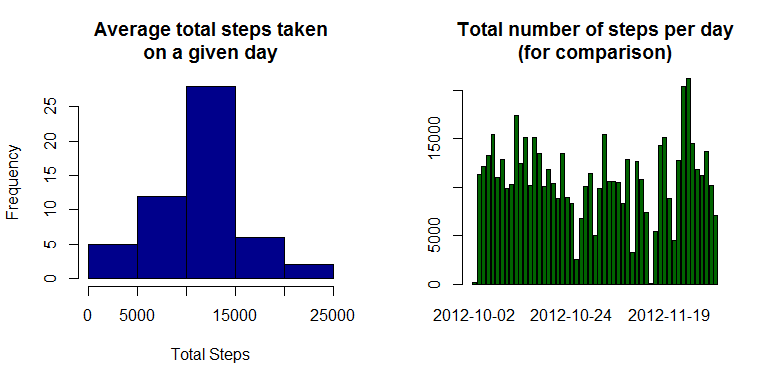
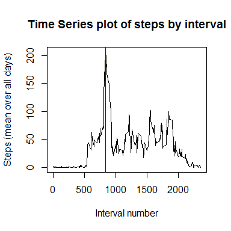
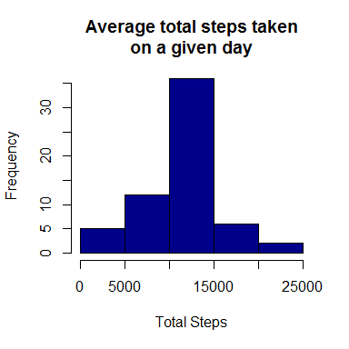
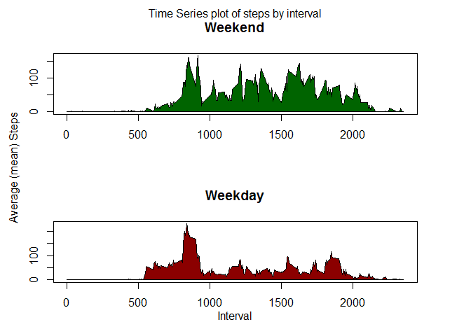

# Reproducible Research: Peer Assessment 1
Michael J. Sabal  
9 August 2016  


## Loading and preprocessing the data
The activity.zip file was decompressed using operating system command line tools to activity.csv.

```r
act <- read.csv("activity.csv")
missingpct <- 100*sum(is.na(act$steps))/nrow(act)
daterange <- range(as.character(act$date))
actobs <- act[!is.na(act$steps),]   # Remove observations where there is no step data.
```
Codebook:  
1. Steps - Number of steps taken in a 5 minute interval. 13.1147541% missing values (NA).  
2. Date - The date the measurement was taken, formatted as YYYY-MM-DD, ranging from 2012-10-01 through 2012-11-30.  
3. Interval - Integer identifier for which 5 minute interval the observation refers to.  

## What is mean total number of steps taken per day?
In aggregating the total steps, missing values are ignored.  This leads to some dates in the observational
range having no totals.  In the following histogram, these dates will be charted as zero.

```r
stepsums <- aggregate(actobs$steps,list(Date = actobs$date),sum)
colnames(stepsums) <- c("Date","Total.Steps")
par(mfrow=c(1,2))
hist(stepsums$Total.Steps,col="darkblue",xlab="Total Steps",main="Average total steps taken\non a given day")
barplot(stepsums$Total.Steps,names.arg=stepsums$Date,col="darkgreen",
    main="Total number of steps per day\n(for comparison)")
```

<!-- -->

```r
# stepavg <- summary(stepsums$Total.Steps)
```
Based on the data provided, the mean steps taken per day is 10766.19, 
and the median is 10765.

## What is the average daily activity pattern?

```r
par(mfrow=c(1,1))
stepts <- aggregate(actobs$steps,list(Interval = actobs$interval),mean)
colnames(stepts) <- c("Interval","Average.Steps")
plot(stepts$Interval,stepts$Average.Steps,type="l",xlab="Interval number",ylab="Steps (mean over all days)",
     main="Time Series plot of steps by interval")
abline(v=stepts$Interval[stepts$Average.Steps==max(stepts$Average.Steps)],col="blue")
```

<!-- -->

```r
# maxsteps <- max(stepts$Average.Steps)
```
Interval number 835 had the highest 
average step count at 206.1698113.

## Imputing missing values
The original activity data set includes 2304 missing step values.  These will be filled in 
using the interval mean.  Because there are several days with no step activity at all, using the daily mean 
would be less meaningful.

```r
act2 <- merge(act,stepts,by.x="interval",by.y="Interval",all.x=TRUE)  
missingvals <- is.na(act2$steps)
act2[missingvals,"steps"] <- act2[missingvals,"Average.Steps"] 
stepsums2 <- aggregate(act2$steps,list(Date = act2$date),sum)
colnames(stepsums2) <- c("Date","Total.Steps")
hist(stepsums2$Total.Steps,col="darkblue",xlab="Total Steps",main="Average total steps taken\non a given day")
```

<!-- -->
  
With the missing data filled in, the mean steps taken per day is now 10766.19, 
and the median is 10766.19.  The mean has remained the same, but the median has increased slightly to match the mean.

## Are there differences in activity patterns between weekdays and weekends?

```r
act2$dow <- weekdays(as.Date(act2$date))
dowtype <- cbind(c("Sunday","Monday","Tuesday","Wednesday","Thursday","Friday","Saturday"),
    c("weekend",rep("weekday",5),"weekend"))
colnames(dowtype) <- c("dow","dowtype")
act2 <- merge(act2,dowtype,by="dow",all.x=TRUE)
par(mfrow=c(2,1),mar=c(4,4,4,4))
wdgroup <- act2[act2$dowtype=="weekday",]
wegroup <- act2[act2$dowtype=="weekend",]
wdts <- aggregate(wdgroup$steps,list(Interval = wdgroup$interval),mean)
wets <- aggregate(wegroup$steps,list(Interval = wegroup$interval),mean)
colnames(wdts) <- c("Interval","Average.Steps")
colnames(wets) <- c("Interval","Average.Steps")
# Shader instructions at http://earlh.com/blog/2009/08/11/shading-pieces-of-an-r-plot/
# (retrieved 9 Aug 2016)
xshader <- c(wets$Interval,rev(wets$Interval))
yeshader <- c(rep(0,nrow(wets)),rev(wets$Average.Steps))
ydshader <- c(rep(0,nrow(wdts)),rev(wdts$Average.Steps))
plot(wets$Interval,wets$Average.Steps,type="l",main="Weekend",xlab="",ylab="")
polygon(xshader,yeshader,col="darkgreen")
plot(wdts$Interval,wdts$Average.Steps,type="l",main="Weekday",xlab="",ylab="")
polygon(xshader,ydshader,col="darkred")
mtext("Time Series plot of steps by interval",side=3,line=-1.5,outer=TRUE)
mtext("Average (mean) Steps",side=2,line=-1.5,outer=TRUE)
mtext("Interval",side=1,line=-2,outer=TRUE)
```

<!-- -->
  
Based on these two plots, this particular individual spends most of their active time earlier in the day, possibly before working at a less active job.  The weekend, in contrast, has more consistent activity throughout the day.  
